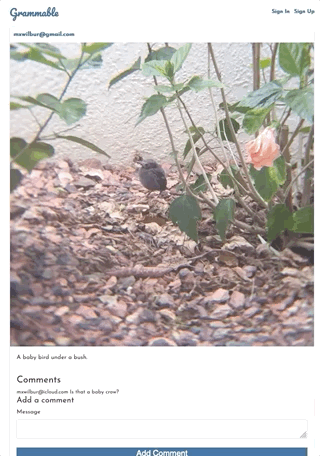

# Grammable

An Instagram clone that was built using industry-standard, test-driven development following numerous red/green/refactor cycles.  Check it out [link](https://Grammable-mike-wilbur.herokuapp.com "here")!

# Usage
- Users can scan all postings.
- User must register to add comments and their own images.

# Software
- Ruby 2.5.3
- Rails 5.2.3
- Bootstrap 4.x
- DB Postgresql
- Carrierwave > 2.0 

# Screenshots

# Bugs
If you find any bugs and would like to report them, you can do so through GitHub issues.  Thanks for your help!

# Authors
Mike Wilbur <mxwilbur@outlook.com>
